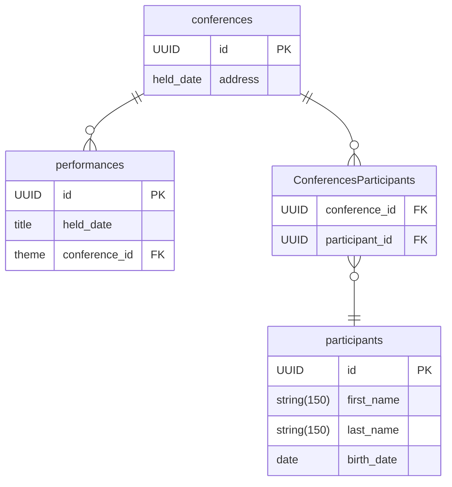

```mermaid
erDiagram
    performances {
        UUID id PK
        title
        held_date
        theme
        conference_id FK
    }
    conferences {
        UUID id PK
        held_date
        address
    }
    participants {
        UUID id PK
        string(150) first_name
        string(150) last_name
        date birth_date
    }
    ConferencesParticipants {
        UUID conference_id FK
        UUID participant_id FK
    }
    conferences ||--o{ ConferencesParticipants : ""
    ConferencesParticipants }o--|| participants : ""
    conferences ||--o{ performances : ""
```
